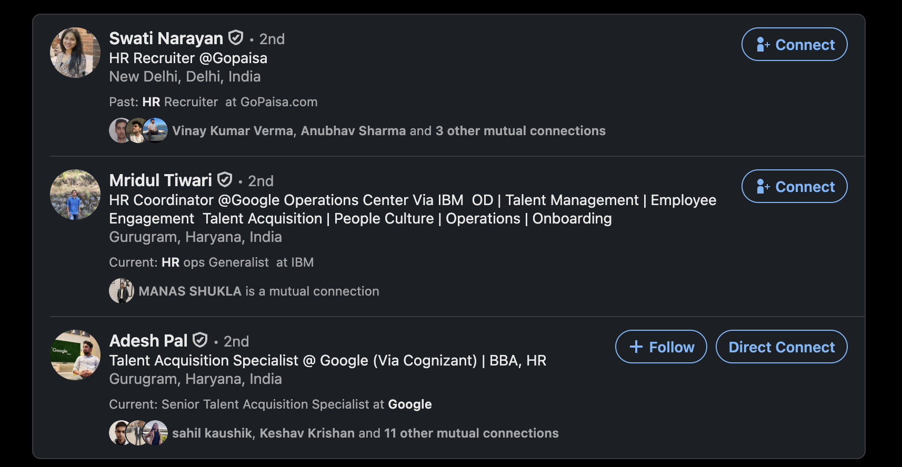

# DirectConnect ⚡

Look, I get it. This extension isn't changing the world. It adds one tiny, hyper-specific feature to LinkedIn. But if you're actively trying to expand your network, you know exactly how annoying the manual process is:

1. Click on their profile from the search results.
2. Wait for it to load.
3. Click "More".
4. Click "Connect".
5. Click "Send without a note".
6. Close the tab.
7. Try to remember where you left off in the search list.

It's completely tedious. **DirectConnect fixes this.**

It injects a "Direct Connect" button directly into the LinkedIn search results right next to the "Follow" or "Message" buttons. You click it once. Behind the scenes, it silently opens the profile in a hidden background tab, navigates the DOM, clicks all the right buttons, sends the connection request, and closes itself—all without ever pulling you away from your search page. 

It adds very little convenience on paper, but it's of **massive utility** when you're networking at scale. You can now breeze down a list of search results with a single click per person.

### Installation
1. Open Chrome and navigate to `chrome://extensions/`
2. Toggle on **Developer mode** in the top right corner.
3. Click **Load unpacked** and select this directory.
4. Head over to LinkedIn's people search and start connecting!
